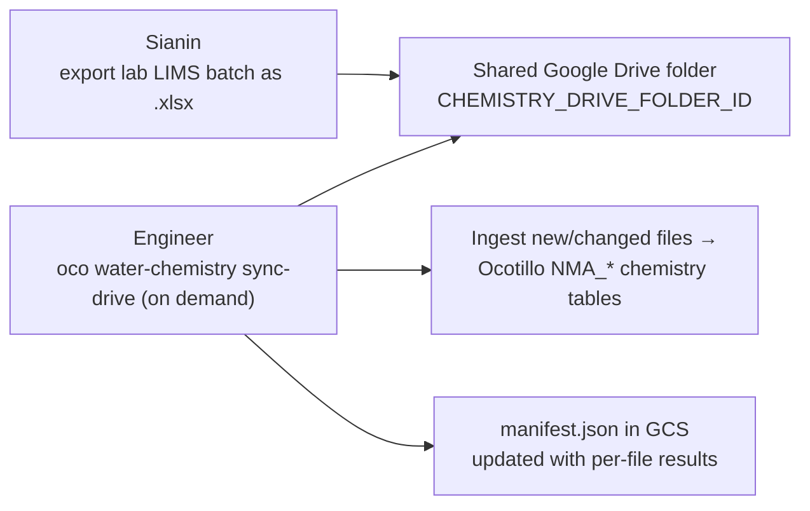

# Chemistry Ingestion — Interim Workaround Runbook

Purpose: capture the known gaps, assumptions, and step-by-step process for
Data Services (Ocotillo) chemistry ingestion, so the manual workaround can be
run consistently while the fuller solution is pursued.

- Jira: [BDMS-1034](https://nmbgmr.atlassian.net/browse/BDMS-1034).
- Code (Data Services path):
  - `services/chemistry_lims.py` — parse a LIMS `.xlsx` and load the legacy
    NMA chemistry tables (analyte mapping ported from AMPAPI `chemfile.py`).
  - `services/chemistry_drive.py` — on-demand ingest of new files from the
    shared Drive folder; updates the manifest. Engineer-triggered; no polling.
  - `cli/cli.py` — `oco water-chemistry bulk-upload` and `oco water-chemistry
    sync-drive`.
- Target tables: `NMA_MajorChemistry`, `NMA_MinorTraceChemistry`,
  `NMA_Chemistry_SampleInfo` (`db/nma_legacy.py`).
- Legacy source: AMPAPI `chemfile.py` (`MajorChemistry` /
  `MinorandTraceChemistry` in SQL Server).

---

## 0. The workaround at a glance



Chemistry is ingested into a single destination: the Ocotillo (Data Services)
Postgres database — the legacy `NMA_MajorChemistry`, `NMA_MinorTraceChemistry`,
and `NMA_Chemistry_SampleInfo` tables.

---

## 1. Roles

- **Sianin** — exports each lab chemistry batch from the LIMS as an `.xlsx`
  workbook and drops it in the shared Drive folder. One workbook per batch.
- **Engineer** (e.g. Kelsey) — explicitly triggers the Data Services ingestion
  CLI against the folder when a run is wanted, reviews the printed results, and
  confirms the manifest updated. Acts on any files reported as `failed`. There
  is no polling or scheduling — ingestion only happens when an engineer runs it.
- **Engineering** — owns the CLI, the analyte map, and the fuller solution.

---

## 2. Prerequisites (Kelsey's machine)

- [ ] Repo checked out; env installed **with the CLI group**:
      `uv sync --locked --group cli` (installs `openpyxl` +
      `google-api-python-client`, which are not part of the API runtime).
- [ ] Postgres (Ocotillo) reachable; `.env` has `POSTGRES_*` (or Cloud SQL)
      creds pointing at the target Data Services database.
- [ ] `GCS_BUCKET_NAME` set (holds the manifest).
- [ ] `CHEMISTRY_DRIVE_FOLDER_ID` set to the shared folder id
      (see `.env.example`). Optional `CHEMISTRY_INGEST_MANIFEST_PATH`
      (default `chemistry-ingest/manifest.json`).
- [ ] Google credentials available with:
      - **read** access to the shared Drive folder,
      - **read/write** on the GCS bucket.
      Locally this is application-default credentials
      (`gcloud auth application-default login`) for an account added to the
      folder; in production it is the base64 `GCS_SERVICE_ACCOUNT_KEY` service
      account (which must be a member of the folder).

---

## 3. Process — Sianin (drop files)

1. Export the lab batch from the LIMS as an `.xlsx` workbook. It must carry the
   standard LIMS columns: `Param`, `Results_Units`, `Dilution`, `AnalysisTime`,
   `SampleNumber`, `CustomerSampleNumber`, `SamplePointID`, `Method`, `Test`,
   `ReportedND`, `LowerLimit`, `SampleDate`.
2. Ensure `SamplePointID` matches the well's PointID / Ocotillo Thing name.
3. Drop the workbook in the shared Drive folder. Do not edit a file in place
   after it has been ingested — a content change re-ingests it (by md5).

---

## 4. Process — Engineer (run the ingest)

Dry run first to see what is new without writing anything:

```bash
oco water-chemistry sync-drive --dry-run
```

Then ingest:

```bash
oco water-chemistry sync-drive
# or point at a specific folder:
oco water-chemistry sync-drive --folder-id <DRIVE_FOLDER_ID>
# machine-readable:
oco water-chemistry sync-drive --output json
```

Read the summary. Buckets:

- **ingested** — file loaded; shows rows imported.
- **skipped** — the whole file was already ingested (manifest has a `success`
  entry and the file's md5 is unchanged).
- **ingested with skipped samples** — a file loads, but any lab sample
  (`WCLab_ID` / SampleNumber) already recorded for the well is skipped and
  listed under `skipped_duplicates`; this is normal and not a failure. New lab
  samples for the same well are appended as a new lettered sample point
  (`MG-030A`, `MG-030B`, ...).
- **failed** — nothing loaded for that file (a data-quality abort). Causes:

| Reported cause | Meaning | Action |
|----------------|---------|--------|
| `Unmapped analyte Param=...` | A LIMS `Param` name is not in the analyte map. | Send the Param name to engineering to add to `FMapper`. |
| `no matching Thing (well) found` | `SamplePointID` has no Ocotillo well. | Verify the PointID; ensure the well was transferred to Data Services first. |

Exit code is non-zero if any file failed.

A single file (bypassing Drive) can be loaded directly:

```bash
oco water-chemistry bulk-upload --file /path/to/batch.xlsx
```

---

## 5. The manifest

- Location: `gs://$GCS_BUCKET_NAME/<CHEMISTRY_INGEST_MANIFEST_PATH>`
  (default `chemistry-ingest/manifest.json`).
- Keyed by **Drive file id**. Each entry records:
  `name`, `md5`, `modified_time`, `status` (`success` / `failed`),
  `rows_imported`, `validation_errors_or_warnings`, `ingested_at`
  (and `error` for hard failures).
- Semantics:
  - A file is **skipped** only when its manifest entry is `success` **and** the
    Drive md5 is unchanged.
  - **failed** or **content-changed** files are retried on the next run.
- The manifest is rewritten after **every** file, so an interrupted run keeps
  its progress.
- Inspect it: `gsutil cat gs://$GCS_BUCKET_NAME/chemistry-ingest/manifest.json`.

---

## 6. What the ingest does (summary)

For each workbook: map each `Param` to an analyte code + target table (major vs
minor) via `FMapper`; compute the value (non-detects become
`LowerLimit × Dilution` with a `<` symbol); collapse duplicate
(SamplePointID, WCLab_ID, analyte) rows (prefer EPA 200.7, or "low bromide" for
Br); resolve the base `SamplePointID → Thing`. Then, per distinct lab sample
(`WCLab_ID`): if that lab sample is already recorded for the well, skip it;
otherwise create a new `NMA_Chemistry_SampleInfo` whose `nma_sample_point_id`
is the base PointID with the **next letter incrementor** appended
(`A`, `B`, ... `Z`, `AA`, ...), and insert the analyte rows under it.
A data-quality problem (a row that fails to map, or a `SamplePointID` with no
matching well) aborts the whole file — nothing is written.

---

## 7. Known gaps

- **Duplicate detection is WCLab_ID-only.** A re-ingest is recognized by the lab
  `WCLab_ID` (SampleNumber). A genuinely new lab sample with a reused SampleNumber
  would be treated as a duplicate and skipped; a re-run of the same sample under a
  new SampleNumber would append a spurious extra lettered sample.
- **`.xlsx` only.** Legacy `.xls` LIMS exports are not read; the file must be
  a modern `.xlsx`.
- **Fixed analyte map.** Unknown `Param` names fail until engineering adds them
  to `FMapper`. Only major + minor analytes are handled — field parameters and
  radionuclides are out of scope.
- **Well must exist first.** `SamplePointID` must already match an Ocotillo
  `Thing.name`; otherwise the file fails.
- **Failed files retry loudly.** A file that fails (e.g. unmapped analyte or a
  missing well) is retried on every run and keeps reporting `failed` until
  resolved.
- **Concurrent runs race the manifest.** Ingestion is engineer-triggered on
  demand by design (no polling/scheduling). But two engineers running
  `sync-drive` at the same time race the manifest object (last write wins) —
  coordinate so only one run is in flight.
- **No alerting.** Failures surface only in the CLI output the engineer reads.
- **Prod excludes the CLI deps.** The `cli` dependency group
  (`openpyxl`, `google-api-python-client`) is not in the production requirements
  export, so the ingest runs from an engineer's machine, not the deployed app.

---

## 8. Assumptions

- One lab batch per `.xlsx`, with the standard LIMS column set (section 3).
- `SamplePointID` == the well PointID == the Ocotillo `Thing.name`.
- All files in the shared folder are chemistry LIMS workbooks (the sync filters
  to `.xlsx` by MIME type).
- Analyses agency is NMBGMR; non-detects and units follow the AMPAPI
  `chemfile.py` conventions.
- The account running the CLI can read the Drive folder, read/write the GCS
  bucket, and reach the Data Services database.

---

## 9. Toward the fuller solution

Candidate improvements, roughly in priority order:

- **Stronger duplicate detection** than WCLab_ID alone (e.g. also compare
  collection date / analyte set) so a reused or missing SampleNumber can't cause
  a wrong skip or a spurious appended sample.
- **Alerting** on failed files (email/Slack) rather than relying on reading CLI
  output.
- Make the **analyte map** data-driven (lexicon-backed) so new params don't
  require a code change.
