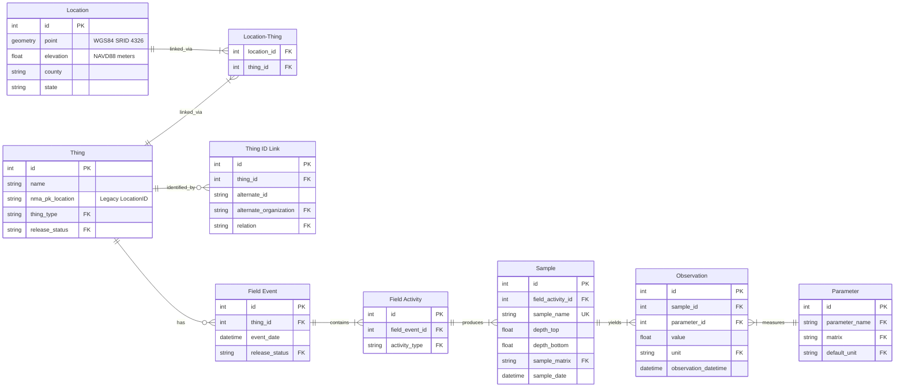
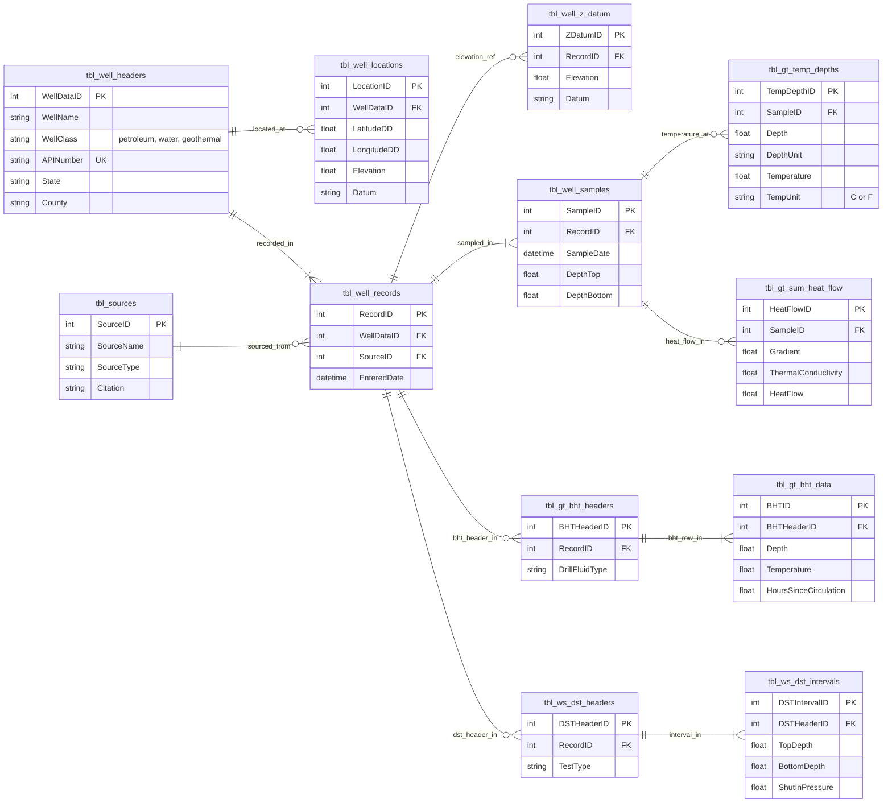

# Ocotillo Data Migration Guide

This guide is for the Ocotillo Data Services team. It covers how to plan, execute, and verify a data migration from a legacy source database into Ocotillo. It is written for a semi-technical audience, with plain-language explanations followed by step-by-step technical detail.

The geothermal migration is the immediate context for this guide, but the process described here applies to any future dataset migration into Ocotillo.


## Table of Contents

1. [What a migration is](#1-what-a-migration-is)
2. [What we were doing and what we are changing](#2-what-we-were-doing-and-what-we-are-changing)
3. [The two types of work](#3-the-two-types-of-work)
4. [Schema mapping: understanding where the data fits](#4-schema-mapping-understanding-where-the-data-fits)
5. [Three tools, three jobs](#5-three-tools-three-jobs)
6. [Migration phases](#6-migration-phases)
7. [Transfer script conventions](#7-transfer-script-conventions)
8. [The audit CLI](#8-the-audit-cli)
9. [Running on staging and production](#9-running-on-staging-and-production)
10. [Geothermal-specific guidance](#10-geothermal-specific-guidance)
11. [Future tooling](#11-future-tooling)


## 1. What a migration is

A data migration is the process of moving data from a legacy system into Ocotillo's database. It is not a one-step operation. At minimum it involves two distinct phases: first, changing the database structure to accommodate the new data (a schema migration), and second, writing a script that reads the legacy data and loads it into the new structure (a data transfer). These two things must happen in order. You cannot load data into a structure that does not yet exist.

Migrations also require significant upfront work before any code is written. Someone needs to understand the source data well enough to know where each field belongs in the new system, which fields to drop, how to handle data quality problems, and what the definitive definition of "done" looks like. Skipping this discovery work leads to scripts that have to be rewritten, schema changes mid-migration, and results that are hard to verify.

The goal of this guide is to make that process repeatable, transparent, and trustworthy so that any team member can understand the state of a migration without having to ask the person who wrote the code.


## 2. What we were doing and what we are changing

The NM_Aquifer migration taught the team a lot. The following problems were documented in the Geothermal Discovery Report and team retrospectives. Each one is named here alongside the specific practice this guide introduces to address it.

### Problem 1: The spreadsheet tracker became stale and untrustworthy

The team maintained a spreadsheet to track migration progress. In review sessions, team members would see rows listed as incomplete for work that had already been done. The sheet was updated separately from the code, so it was always running behind.

**What changes:** The field mapping tracker stays in Google Sheets, but updating it becomes part of the definition of done for a migration task. The PR description must include a direct link to the relevant rows in the tracker showing them updated. Reviewers check this as part of approving the PR. If the PR is merged, the tracker is current. There is no separate step.

### Problem 2: There was no clear place to look for outstanding work

Outstanding work was tracked informally across the spreadsheet, conversations, and JIRA. It was not always clear what was actively in progress, blocked, or waiting on a decision.

**What changes:** JIRA is the single source of truth for what needs to be done. If there is no open ticket, the work is not scheduled. The tracker and the reconciliation summary tell you what happened. JIRA tells you what comes next.

### Problem 3: Schema and mapping decisions were made informally and not recorded

Decisions about where a source field maps, whether to drop it, or how to handle a data quality issue were made in conversations or left as code comments. Later team members had to reverse-engineer intent from the implementation.

**What changes:** Significant mapping decisions are documented as Architecture Decision Records (ADRs) before code is written. The field mapping tracker captures the per-field outcome. The reasoning is preserved alongside the result.

### Problem 4: No standardized way to verify a migration was complete

After a transfer script ran, confirming that all expected rows came over required manual inspection or one-off queries. There was no consistent, repeatable audit step.

**What changes:** `oco transfer-results` is run after every staging and production migration and the output is committed to the repo at `transfers/metrics/transfer_results_summary.md`. Row counts are verifiable by anyone from a single file.


## 3. The two types of work

Every migration involves two categories of work that are easy to conflate but must be kept distinct.

### Schema migrations (Alembic)

A schema migration changes the structure of the Ocotillo database: adding tables, adding columns, modifying constraints. These are managed by [Alembic](https://alembic.sqlalchemy.org/) and live in `alembic/versions/`.

Schema migrations must be applied before data can be loaded. They are version-controlled and run in order. Every environment (local, staging, production) must be up to date before a transfer script is run.

```bash
# Generate a new migration from ORM model changes
alembic revision --autogenerate -m "add geothermal activity type"

# Preview the SQL that would run (without applying it)
alembic upgrade head --sql

# Apply migrations to the current database
alembic upgrade head
```

### Data transfers (Python scripts)

A data transfer reads rows from a legacy source (typically a CSV exported from the legacy system) and loads them into the new Ocotillo schema. Transfer scripts live in `transfers/` and are plain Python modules.

Every transfer script must be **idempotent**: safe to run multiple times without creating duplicate data. Scripts check for existing rows before inserting and skip anything that is already present. This allows a script to be re-run safely if something fails partway through, or if new source data is added later.

```bash
# Run a transfer script
source .venv/bin/activate
set -a; source .env; set +a
python -m transfers.my_dataset_transfer
```


## 4. Schema mapping: understanding where the data fits

Before any code is written, the team needs a clear picture of how source fields map to the existing Ocotillo schema. This section describes the tools and the required decisions.

### The existing Ocotillo data hierarchy

All measurement data in Ocotillo follows a single hierarchical chain. Understanding this chain is the key to knowing where any new data belongs.



Water level data and chemistry data already flow through this chain. Geothermal measurements are structurally similar and are expected to follow the same path.

### The NM_Wells source schema (priority tables)

This diagram shows the source tables in NM_Wells that correspond to the highest-priority geothermal data. These are the tables used in the most common data request queries (temperature depth, heat flow, bottom-hole temperature, drill stem tests).



> **FigJam visual:** A shared FigJam board with both schemas side by side and mapping annotations will be linked here once available. The board will show source-to-target arrows and note the key ADR decisions for each table group. `<!-- FIGJAM_URL_PLACEHOLDER -->`

### Required ADRs before any geothermal script is written

Two schema decisions must be documented as Architecture Decision Records and closed before any geothermal transfer code is written:

1. **Measurement path:** Do geothermal measurements (temperature, heat flow, BHT) go through the existing `Sample → Observation → Parameter` path with new `Parameter` lexicon entries, or do they get dedicated tables? The commented-out stubs in `db/geothermal.py` represent an earlier approach that references a legacy `well.id` FK and is not compatible with the current schema. The Geothermal Discovery Report implies the generic path fits; this must be confirmed as a team decision before scripts are written.

2. **Well deduplication:** NM_Wells contains approximately 54,000 wells across petroleum, water, and geothermal classes. A subset of these overlap with wells already in Ocotillo from the NM_Aquifer migration. The strategy for matching and deduplicating these records (using API numbers, `LocationId`, or a combination) must be agreed before any wells are inserted into `Thing`.

### Tools for schema mapping work

- **[dbdiagram.io](https://dbdiagram.io):** Free browser tool that accepts DBML syntax. The existing Postgres schema can be exported as DBML using the `pg_dump` utility or a short script. The NM_Wells schema comes from the database backup. Both can be loaded into dbdiagram.io and shared as a URL for async review before writing any code.
- **The field mapping tracker (Google Sheets):** One row per source field, populated during the discovery phase. This is the decision record: where does the field go, what is the migration path, is it being migrated at all. No script is written until the relevant rows are filled in.
- **`alembic revision --autogenerate --sql`:** After proposing ORM model changes, this command previews the exact SQL that would run without applying it. Use it to validate that a schema design matches intent before touching any database.
- **Mermaid diagrams in ADRs:** Include a diagram in each ADR that shows the specific tables and relationships being decided on. The diagrams in this guide (above) can be used as a starting point.

**The rule:** no transfer script is written until the relevant field mapping tracker rows are populated and the ADRs for that dataset are closed.


## 5. Three tools, three jobs

A core problem in the NM_Aquifer migration was that one spreadsheet was used for three different jobs. Each job has a different owner, a different update cadence, and a different audience. Keeping them separate is what makes the process trustworthy.

### JIRA — "What still needs to be done"

Every migration scope item lives as a JIRA ticket. This is where outstanding work is assigned, prioritized, and enters a sprint. If a ticket is open, the work is not done. If there are no open tickets for a dataset, the team has finished with it.

JIRA is what you open when you want to know what to work on next.

### The field mapping tracker — "How does each source field map to the new schema"

This is a field-level reference document maintained in Google Sheets. It records: where does `tbl_well_headers.WellName` go? What is the migration path? Was it completed?

It is not a task queue. It records decisions and confirms they were carried out. The tracker rows for a given dataset are updated before the PR is merged, and the PR description must include a direct link to the relevant rows. This makes the tracker update part of code review rather than a follow-up task that gets skipped.

**Transfer Status values:**

| Value | Meaning |
|-------|---------|
| `final transfer complete` | Script has run on production and row counts verified |
| `staging transfer complete` | Script has run on staging, not yet on production |
| `incomplete` | Mapping is defined but script not yet written or run |
| `not being migrated` | Field has been reviewed and will not be migrated |

**Full column set** (same format as the NM_Aquifer tracker):

| Column | Description |
|--------|-------------|
| `Source_TableField` | Source field in dot notation (e.g. `tbl_well_headers.WellName`) |
| `Final Schema Target` | Destination field in Ocotillo (e.g. `thing.name`) |
| `Migration Path` | `direct-to-final`, `stage then refactor`, or `N/A` |
| `Temp Schema Target` | Intermediate staging column if path is `stage then refactor` |
| `Final Mapping Status` | `defined` or `undefined` |
| `Final Target Status` | `exists` or `missing` (does the column exist in the DB yet) |
| `Transfer Status` | See values above |
| `Source NonNull Count` | Row count from the source system |
| `Dest NonNull Count` | Row count in the destination after transfer |
| `NonNull Diff` | Difference between source and destination counts |

### `oco transfer-results` summary — "Did the numbers add up"

After every staging or production run, the audit CLI compares source row counts to destination row counts and writes a markdown summary to `transfers/metrics/transfer_results_summary.md`. This file is committed to the repo after each run.

It is the receipts. When someone asks "did everything come over?", you open this file.

### The workflow that connects all three

```
1. Create JIRA ticket for the dataset or scope     → work is visible and assigned
2. Run discovery, populate tracker in Sheets       → decisions are documented
3. Get ADRs approved for schema decisions          → approach is confirmed
4. Write Alembic migration (if schema changed)     → structure exists in DB
5. Write transfer script                           → code exists
6. Update tracker rows to "staging transfer        → mapping is recorded
   complete"; link rows in PR description
7. Merge PR, run on staging                        → data is in staging
8. Run oco transfer-results                        → numbers are verified
9. Data owner reviews records in the UI            → sign-off from subject expert
10. Run on production                              → data is live
11. Update tracker to "final transfer complete"    → status is accurate
12. Commit transfer-results summary to repo        → receipts are in git
13. Close the JIRA ticket                          → nothing is open
```

When these three sources agree (no open JIRA ticket, tracker in Sheets shows `final transfer complete`, `Missing Agreed` = 0 in the summary), anyone on the team can verify the migration is complete without asking the developer who wrote the script.


## 6. Migration phases

Each dataset migration moves through the following phases in order. Work in a later phase should not begin until the earlier phase is complete.

| Phase | Name | Work done |
|-------|------|-----------|
| 0 | Discovery | Understand the source schema. Document field-level mappings in the tracker (Google Sheets). Identify data quality issues. Determine which tables are in scope. |
| 1 | Schema design | Write ADRs for significant decisions. Write Alembic migrations for any new tables or columns. Apply migrations to local and staging databases. |
| 2 | Script development | Write the transfer script. Implement idempotency, logging, and error handling. Test locally. Update tracker rows to `incomplete` while in progress. |
| 3 | Staging run | Run the script on staging. Run `oco transfer-results`. Confirm zero `Missing Agreed`. Update tracker rows to `staging transfer complete` and link them in the PR description before merging. |
| 4 | Sign-off | Data owner opens the relevant list and detail pages in Ocotillo staging and confirms the data looks correct. Document sign-off in the JIRA ticket. |
| 5 | Production run | Run the script on production. Run `oco transfer-results`. Confirm zero `Missing Agreed`. Update tracker to `final transfer complete`. Commit the summary. Close the ticket. |


## 7. Transfer script conventions

All transfer scripts in this repo follow a consistent set of conventions. Before writing a new script, read at least one existing one in full.

**Good reference scripts:**
- `transfers/migrate_nmbgmr_site_names.py` — clearest example of idempotency and logging patterns. Good starting point for any backfill or one-time migration.
- `transfers/waterlevels_transfer.py` — example of the full `FieldEvent → FieldActivity → Sample → Observation` chain with batch Core inserts.
- `transfers/well_transfer.py` — example of high-volume well header migration with parallel workers.

### File and module conventions

- **Location:** `transfers/<dataset_name>_transfer.py`
- **Runnable as a module:** `python -m transfers.<script_name>` (not as a direct script)
- **Entry point:** a `run()` function called from `if __name__ == "__main__": run()`

### Idempotency

Every script must be safe to run multiple times. Before inserting, build a set of records that already exist in the destination and skip anything in that set.

```python
# Build the set of existing keys
existing_keys = set(
    session.execute(
        select(MyModel.source_id).where(...)
    ).scalars().all()
)

# Filter candidates to only new rows
rows_to_insert = [r for r in candidates if r["source_id"] not in existing_keys]
```

### Batch inserts (Core, not ORM)

For any table with more than a few hundred rows, use SQLAlchemy Core batch inserts. Do not use `session.bulk_save_objects()` — it still instantiates ORM objects and is significantly slower at volume.

```python
if rows_to_insert:
    session.execute(insert(MyModel), rows_to_insert)
    session.commit()
```

See `AGENTS.md` for a full explanation of the performance reasoning.

### Logging

Use Python's standard `logging` module at `INFO` level. Log the following at minimum:

- Source file being read and row count after filtering
- Number of records matched to a destination entity
- Number of records already in the database (skipped)
- Number of rows inserted
- Any critical failures

```python
import logging
logging.basicConfig(level=logging.INFO, format="%(levelname)s %(message)s")
logger = logging.getLogger(__name__)

logger.info("Reading %s", csv_path)
logger.info("%d rows with a non-empty value", len(df))
logger.info("%d / %d matched a Thing in the database", len(id_map), len(df))
logger.info("%d rows already in the database", len(existing_keys))
logger.info("%d new rows to insert", len(rows_to_insert))
logger.info("Done. Inserted %d rows.", len(rows_to_insert))
```

### Error handling

Wrap each commit in a `try/except`. On failure, roll back, log at `critical`, and continue to the next group rather than aborting the entire run.

```python
try:
    session.execute(insert(MyModel), batch)
    session.commit()
except Exception as e:
    session.rollback()
    logger.critical("Failed to insert batch: %s", e)
```

### Minimal script template

```python
"""
One-sentence description of what this script migrates.

Usage (from repo root, with venv active):
    python -m transfers.my_dataset_transfer
"""

import logging

import pandas as pd
from sqlalchemy import insert, select

from db import MyModel
from db.engine import session_ctx
from transfers.util import get_transfers_data_path

logging.basicConfig(level=logging.INFO, format="%(levelname)s %(message)s")
logger = logging.getLogger(__name__)


def run():
    csv_path = get_transfers_data_path("my_dataset.csv")
    logger.info("Reading %s", csv_path)

    df = pd.read_csv(csv_path, dtype=str)
    # Filter to rows with the values we need
    df = df[df["SourceField"].notna()].copy()
    logger.info("%d rows after filtering", len(df))

    with session_ctx() as session:
        # Build a source-id -> thing_id map in one query
        source_ids = df["SourceId"].tolist()
        id_map = {
            source_id: thing_id
            for source_id, thing_id in session.execute(
                select(MyModel.source_id, MyModel.id).where(
                    MyModel.source_id.in_(source_ids)
                )
            ).all()
        }
        logger.info("%d / %d source IDs matched", len(id_map), len(df))

        # Build candidate rows
        candidates = []
        for row in df.itertuples(index=False):
            thing_id = id_map.get(row.SourceId)
            if thing_id is None:
                continue
            candidates.append({"thing_id": thing_id, "value": row.Value})

        # Skip rows that already exist (idempotent)
        existing_keys = set(
            session.execute(
                select(MyModel.thing_id).where(...)
            ).scalars().all()
        )
        rows_to_insert = [r for r in candidates if r["thing_id"] not in existing_keys]
        logger.info("%d already in database, %d to insert", len(existing_keys), len(rows_to_insert))

        if not rows_to_insert:
            logger.info("Nothing to do.")
            return

        session.execute(insert(MyModel), rows_to_insert)
        session.commit()
        logger.info("Done. Inserted %d rows.", len(rows_to_insert))


if __name__ == "__main__":
    run()
```


## 8. The audit CLI

`oco transfer-results` is the built-in reconciliation tool. It compares source CSV row counts to destination Postgres table row counts and produces a markdown summary.

See `transfers/README.md` for full usage. The key commands:

```bash
source .venv/bin/activate
set -a; source .env; set +a

# Run and write summary to the standard path
oco transfer-results --summary-path transfers/metrics/transfer_results_summary.md

# Run with sample output for debugging
oco transfer-results --sample-limit 5
```

If `oco` is not on your PATH:

```bash
python -m cli.cli transfer-results --summary-path transfers/metrics/transfer_results_summary.md
```

### Reading the output

| Column | What it means |
|--------|---------------|
| `Source Rows` | Raw row count in the source CSV |
| `Agreed Rows` | Rows considered in scope by the transfer rules |
| `Dest Rows` | Current row count in the destination table |
| `Missing Agreed` | `Agreed Rows - Dest Rows` |

**A non-zero `Missing Agreed` on a script that is marked complete is a red flag.** Do not move to production until it is resolved. Common causes: a filter condition in the script that is too strict, an idempotency check that is inadvertently skipping valid rows, or a data quality issue in the source that was not anticipated.

### Committing the summary

After every staging and production run, commit the updated summary:

```bash
git add transfers/metrics/transfer_results_summary.md
git commit -m "Update transfer results summary after <dataset> migration"
```

This makes the reconciliation results auditable in git history.


## 9. Running on staging and production

Follow this checklist for every migration. Do not skip steps, even if the migration seems simple.

### Before running

- [ ] PR is merged (schema migration + transfer script); tracker rows linked in PR description and updated in Sheets
- [ ] ADRs for this dataset are closed and linked in the JIRA ticket
- [ ] Data owner has been notified and knows to review after the staging run

### Staging

```bash
# 1. Pull latest
git pull

# 2. Apply schema migrations (only if this PR includes Alembic changes)
source .venv/bin/activate
set -a; source .env; set +a
alembic upgrade head

# 3. Run the transfer script
python -m transfers.<script_name>

# 4. Run the audit
oco transfer-results --summary-path transfers/metrics/transfer_results_summary.md
```

- [ ] `Missing Agreed` = 0 for all affected tables
- [ ] Data owner has reviewed the relevant pages in staging and confirmed the data looks correct
- [ ] Transfer results summary committed to the repo
- [ ] Tracker rows updated to `staging transfer complete` in Google Sheets (linked in the merged PR description)

### Production

```bash
# Same steps as staging, on the production server
git pull
alembic upgrade head   # if schema changed
python -m transfers.<script_name>
oco transfer-results --summary-path transfers/metrics/transfer_results_summary.md
```

- [ ] `Missing Agreed` = 0 for all affected tables
- [ ] Transfer results summary committed to repo
- [ ] Tracker CSV rows updated to `final transfer complete` in a follow-up commit or PR
- [ ] JIRA ticket closed


## 10. Geothermal-specific guidance

This section applies specifically to the upcoming migration of geothermal and subsurface data from the NM_Wells database. It is grounded in the April 2026 Geothermal Data Discovery Report.

### Source database

**NM_Wells** is an MSSQL database accessed via a Microsoft Access frontend. Bureau staff cannot currently enter data directly due to a compatibility bug. Source data for migration should be exported to CSV from the database backup. The CSVs go in `transfers/data/nm_wells_csv_cache/` following the same convention as `transfers/data/nma_csv_cache/`.

### Recommended migration order

The Geothermal Discovery Report recommends prioritizing the tables used in the most common data requests. The migration order below reflects both data dependencies and user value.

**Step 1: Well headers and locations**
Migrate `tbl_well_headers` and `tbl_well_locations` into `Thing` and `Location`. This is the foundation everything else depends on. Follow the same pattern as `well_transfer.py`.

Note: NM_Wells contains approximately 54,000 wells. A subset overlap with wells already in Ocotillo from NM_Aquifer. Deduplication strategy must be defined in an ADR before this step begins. See [required ADRs](#required-adrs-before-any-geothermal-script-is-written) above.

**Step 2: Geothermal measurement data**
Migrate the core geothermal measurement tables into `FieldEvent → FieldActivity → Sample → Observation`. Follow the same pattern as `waterlevels_transfer.py`.

Priority tables and their mapping targets:

| NM_Wells table | Ocotillo target | Notes |
|----------------|-----------------|-------|
| `tbl_well_records` | `FieldEvent` | Source of the record event date and source linkage |
| `tbl_well_samples` | `Sample` | Depth intervals map to `depth_top`/`depth_bottom` |
| `tbl_gt_temp_depths` | `Observation` (via Sample) | One row per depth/temperature measurement |
| `tbl_gt_bht_headers` + `tbl_gt_bht_data` | `Sample` + `Observation` | BHT header becomes Sample; each BHT row becomes Observation |
| `tbl_gt_sum_heat_flow` | `Observation` (via Sample) | Gradient, conductivity, heat flow as separate parameters |
| `tbl_ws_dst_headers` + `tbl_ws_dst_intervals` | `Sample` + `Observation` | DST header becomes Sample; each interval becomes Observation |

**Step 3: Source and provenance data**
Migrate `tbl_sources` and `tbl_well_z_datum`. Source records preserve the provenance of each measurement. Z-datum records provide elevation references for depth measurements. These are important for data integrity but should not block Step 2.

**Step 4: Additional NM_Wells datasets**
Lithology, oil and gas attributes, and other tables in NM_Wells should be prioritized based on user need. Before migrating any of these, confirm with the geothermal team whether the data is still actively used and whether an authoritative external source already exists.

**Step 5: Subsurface Library**
The Subsurface Library is a separate MSSQL database containing metadata about physical artifacts (cores, cuttings, logs). It does not share common IDs with NM_Wells, which makes merging the two datasets more complex. A subset of petroleum wells in both databases can be matched using API numbers. This step should not begin until NM_Wells Step 1 is complete, and requires its own discovery and ADR process.

### Known data quality issues

These issues were documented in the Geothermal Discovery Report and must be addressed in transfer scripts.

**Unit inconsistency:** Temperature values in NM_Wells may be recorded in Fahrenheit or Celsius. Depth values may be in feet or meters. Scripts must inspect the unit columns for each row and normalize to a standard unit (Celsius for temperature, meters for depth) at import time. Log the original unit in a notes field or as a separate observation attribute.

**Duplicate records:** Early spreadsheet imports into NM_Wells were conducted without deduplication checks. Duplicate well entries may appear as identical records or as slightly different entries for the same location. Scripts should check for existing wells by API number and `LocationId` before inserting and log any duplicates encountered for manual review.

**Provenance gaps:** Many measurements in NM_Wells come from historical records where the source or collection method is not fully documented. Always preserve whatever source information is available from `tbl_sources`. Do not silently drop source references, even if the information is incomplete.

**Transcription errors:** Some measurements contain obviously incorrect values (a temperature of 1000°F, a depth exceeding the well's documented total depth). Scripts should log but not reject anomalous values. The data owner should review flagged rows after the staging run.

### Tables confirmed not to migrate

The following categories of tables in NM_Wells were reviewed and confirmed as out of scope in the Geothermal Discovery Report:

- Tables prefixed `OCD_` or `tbl_OCD_`: related to a concluded research project
- Tables prefixed `sub_`: copies of Subsurface Library tables
- Tables with `OLD`, `copy`, or `BAD` in the name: temporary copies that were never deleted
- Empty tables

### Note on `db/geothermal.py`

This file contains fully commented-out stubs for geothermal-specific ORM models (`GeothermalTemperatureProfile`, `GeothermalBottomHoleTemperatureHeader`, etc.). These stubs reference a legacy `well.id` foreign key and are not compatible with the current `Thing`-centric schema. They represent an earlier approach.

Before reviving these models, the team must decide (via ADR) whether dedicated geothermal tables are needed or whether the existing `Sample → Observation → Parameter` path is sufficient. If dedicated tables are chosen, the stubs in `db/geothermal.py` should be rewritten from scratch against the current schema rather than adapted from the commented code.


## 11. Future tooling

### Migration reconciliation in Ocotillo

A future improvement worth considering is a lightweight read-only admin page in Ocotillo that runs the reconciliation query on demand and displays a table of datasets with source counts, destination counts, and a status badge. This would be particularly useful once five or more datasets have been migrated and stakeholders need visibility without opening a terminal.

This is a product feature with design and engineering cost. It should be scoped and prioritized on the product roadmap when the team has the capacity. The current `oco transfer-results` CLI plus committing the summary to git is sufficient in the near term.

### Automated reconciliation on deploy

Another option is a CI/CD step that runs `oco transfer-results` automatically after each production deployment and fails the deploy if `Missing Agreed` is non-zero for any previously completed migration. This would catch regressions where a schema change accidentally drops rows. Worth considering as the number of migrated datasets grows.
