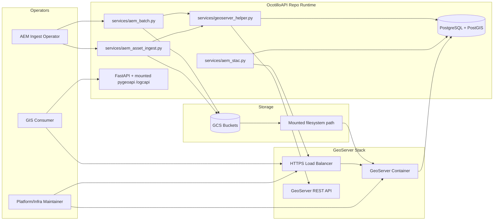

# GeoServer Architecture Snapshot (2026-05-18)

## System Context

## Main Runtime Flows

### 1. GeoTIFF publish flow
1. AEM ingest uploads GeoTIFF to GCS.
2. AEM ingest/batch invokes GeoServer publisher helper.
3. Publisher resolves mounted source path and calls GeoServer REST.
4. Publisher updates asset publish tracking fields in DB.

### 2. STAC service-link flow
1. STAC collection payload is built.
2. If GeoServer env vars are set, collection assets include WMS/WFS/WCS links.
3. GIS clients discover GeoServer endpoints via those links.

### 3. Current hybrid serving flow
1. OGC API Features remains on mounted pygeoapi under /ogcapi.
2. GeoServer handles AEM raster publication and related OWS exposure.

## Deployment Topology (Defined in IaC)
- GCP VM + instance group + HTTPS load balancer.
- Startup script installs docker and gcsfuse, mounts bucket paths, runs GeoServer container.
- Domain front door configured for https://geoserver.newmexicowaterdata.org/geoserver.

## Boundary Clarification
- OcotilloAPI remains the primary app/API process for core REST and pygeoapi-backed OGC Features.
- GeoServer is currently a specialized publishing tier for AEM-oriented map/coverage/feature service surfaces.
